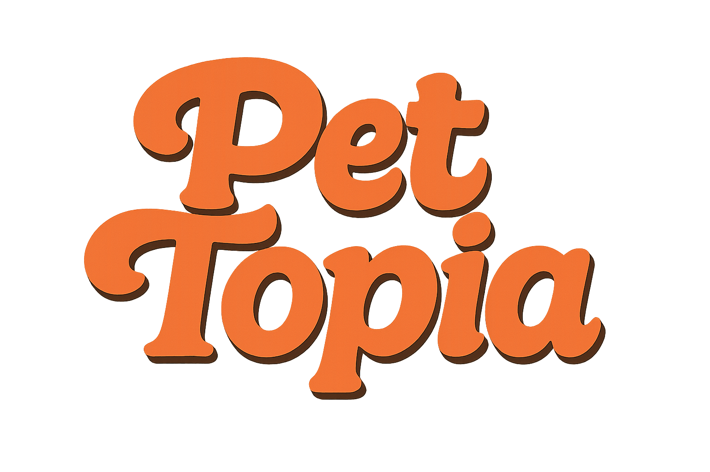
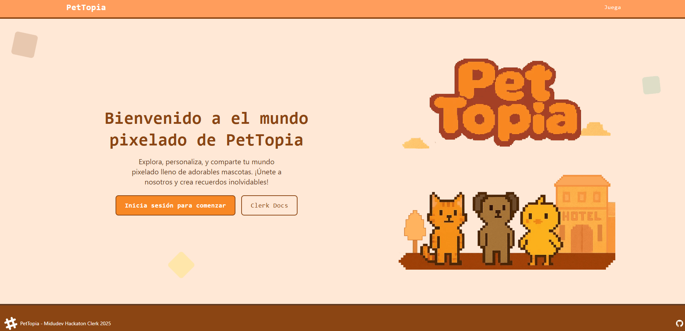
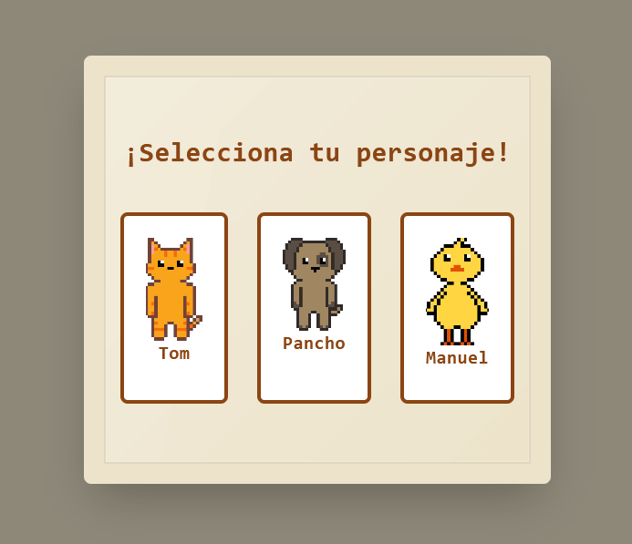

# PetTopia Minigame
PetTopia es un minijuego de exploración en un hotel de mascotas con un par de salas de juego, a medida que descubre el hotel podrás encontrar elementos que te permitirán personalizar a tu mascota.

- Para jugar deberás registrarte en la web integrada con Clerk con tu Github o Google, luego tendrás una selección de mascota y así podrás conservar tu progreso.

## Midudev Clerk Hackathon
Este proyecto fue creado para el Hackathon de Midudev y Clerk, donde se buscaba crear una aplicación que utilizara la SDK de Clerk e integrar sus distintas funcionalidades disponibles.

## Uso de Clerk en PetTopia

En PetTopia, Clerk se utiliza como solución de autenticación y gestión de usuarios. Clerk permite a los usuarios registrarse e iniciar sesión fácilmente usando los proveedores de GitHub y Google, asegurando una experiencia de acceso rápida y segura.

### ¿Cómo se ha integrado Clerk en el proyecto?

- **Protección de rutas:** Se utiliza un middleware (`src/middleware.ts`) que protege rutas como `/play`, `/settings` y `/profile`, permitiendo el acceso solo a usuarios autenticados. Si un usuario no ha iniciado sesión, es redirigido automáticamente a la página de inicio de sesión de Clerk.
- **Componentes de Clerk:** Se emplean componentes como `SignInButton`, `UserButton` y `UserProfile` para mostrar el estado de autenticación, gestionar el perfil del usuario y permitir el cierre de sesión desde la interfaz.
- **Persistencia de selección de personaje:** Cuando el usuario selecciona un personaje en la página de juego (`/play`), esta información se guarda en los metadatos del usuario de Clerk (`unsafeMetadata.character`). Así, cada usuario puede conservar su progreso y personalización.
- **Localización y apariencia:** Clerk está configurado para mostrar la interfaz en español y con un tema oscuro personalizado, según la configuración en `astro.config.mjs`.

Gracias a Clerk, la gestión de usuarios en PetTopia es sencilla, segura y completamente integrada con la experiencia del juego.

## Screenshots

